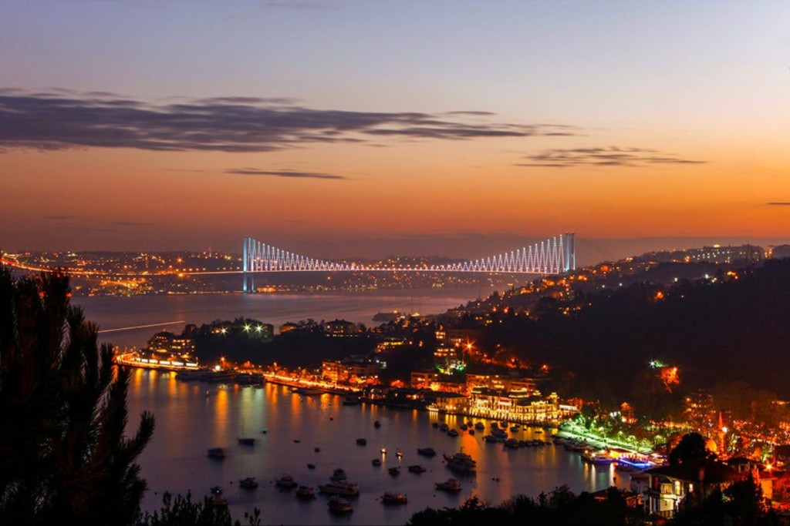
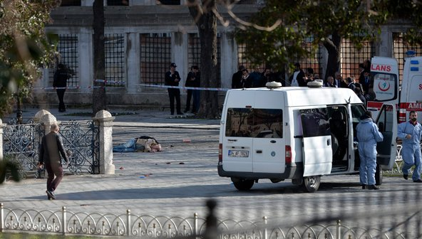
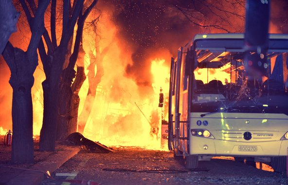
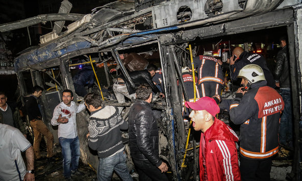
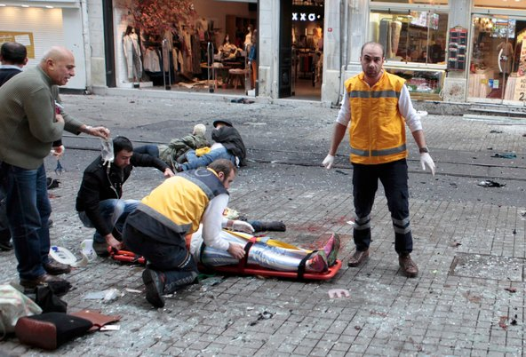
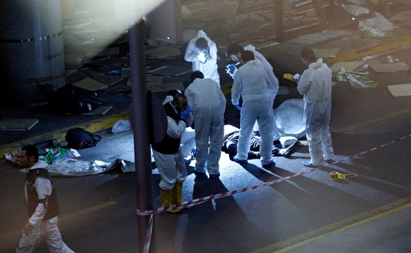
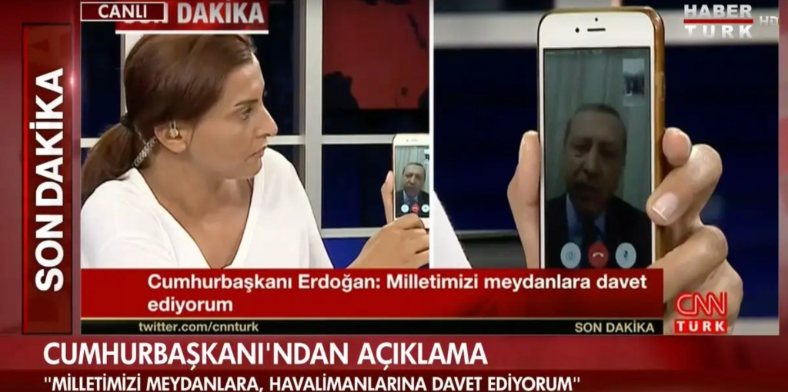

*afternoon.* the summer after my sophomore year of high school, i was living in a university dorm in istanbul. on a hot friday afternoon, three of my friends and i went to a nargile kafe just off campus, the kind that would happily serve 16-year-olds.

from the terrace there, you could see the bosphorus bridge in its full stretch, one end in asia, the other in europe. suspended between turkey’s islamic roots and its european aspirations.

just as we were settling in, my friend sina said “we need to head back. my dad just texted. he saw tanks on the bosphorus bridge. he says the last time that happened was in [1980](https://en.wikipedia.org/wiki/1980_Turkish_coup_d%27%C3%A9tat).”

we paid the bill and caught the next bus back to campus.

on campus, everything seemed normal. we went to the cafeteria, which was open 24/7, with bad food and horse racing on a small tv. i sat down with my friends and googled:

turkish military news

tanks on the bosphorus bridge

as i was scrolling through news sites, i could feel the anxiety rising with the noise in the cafeteria. it was getting noticeably more crowded.

the more urgent everything felt, the slower my connection seemed to get.

what was going on?

*night.* at midnight, the entire cafeteria went silent. for the first time all summer, everyone’s eyes were fixed on the tv in the corner.

a news anchor was on screen announcing:

“the turkish military has completely taken over the administration of the country to reinstate constitutional order. a curfew and martial law is in effect across the country.”

we had gotten one answer. but now, we had a hundred more questions.

i’d learned about the 1980 coup from my parents: mass arrests, torture, executions. i knew the coup would mean that, overnight, the direction of the entire country would shift, and with it, all of our lives.

tension had been high in turkey for some time. over the past year, there have been a number of attacks in the country. some by the neighboring islamic state, others by the kurdish militia.

and just two weeks earlier, there was another one.

every table in the cafeteria had become its own little newsroom. people were trying to make sense of it all. each minute was bringing a new piece of chaos.

a friend in ankara told us the military was bombing the parliament building.

they were saying a police helicopter was shot down by a fighter jet.

wait… the police are fighting the army?

no one could make sense of it. every update made things more surreal.

soon after, the cafeteria fell silent for the second time. another announcement was on the tv. this time, it was the president.

he appeared via facetime, speaking to a tv anchor who held the phone up to the camera. he asked the citizens to go on the streets and resist the military. “halkın gücünün üstünde bir güç tanımam,” he said. “to this day, i have never recognized any power above that of the people”

*morning.* after his call, crowds began to flood the streets. explosions continued throughout the night.

at 6am, we saw on tv the images of soldiers on the bosphorus bridge, with their arms raised in surrender.

the coup attempt failed.

that night changed how i understood my nation, not as a stable structure, but as a fragile one held up by the constant effort of those who believe in it.

at the time, i came away with a deep appreciation for the people who work, fight, and sometimes risk everything to keep this ancient structure standing.

*note on inconsistencies.* i wrote this from memory, and parts of it do not match the timeline reconstructed by [bellingcat from the plotters’ whatsapp group](https://www.bellingcat.com/news/middle-east/2016/07/24/the-turkey-coup-through-the-eyes-of-its-plotters/) and the [wikipedia chronology](https://en.wikipedia.org/wiki/2016_Turkish_coup_d%27%C3%A9tat_attempt). a few things i would flag: i remember the kafe as a friday afternoon, but the tanks did not actually block the bosphorus bridge until around 21:45, so it must have been closer to evening; what i recall as a single news anchor reading the statement was probably the second of two trt broadcasts, an earlier one around 23:18 and tijen karaş’s forced reading around 00:05–00:13; the parliament bombing and the shot-down police helicopter that my friend in ankara reported actually happened much later that night, and the parliament being hit from the air around 03:08–03:33, so i probably collapsed several hours of news into one stretch of conversation. i kept the original ordering because it is how i lived through it, but for what actually happened, the two links above are the better sources.
